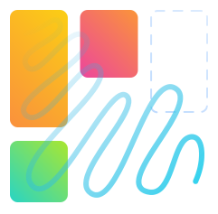
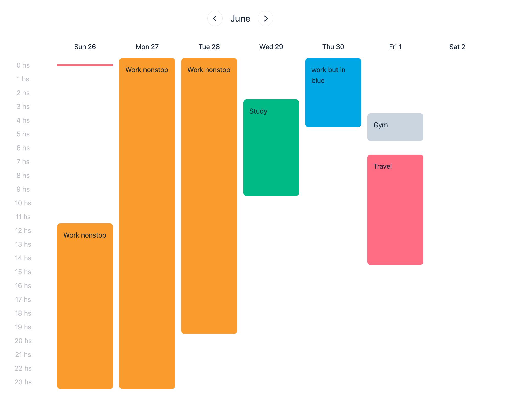
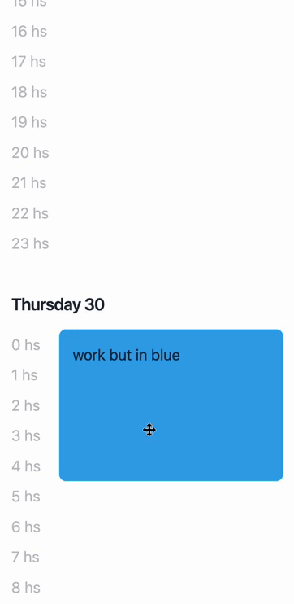
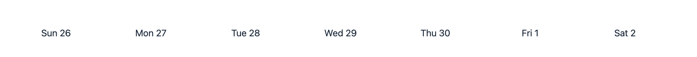
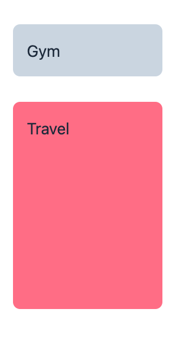
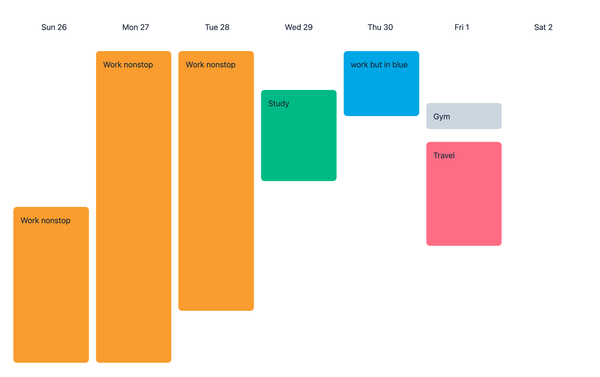
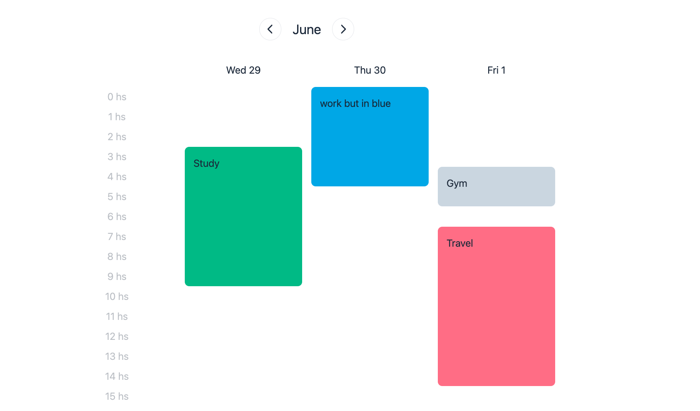
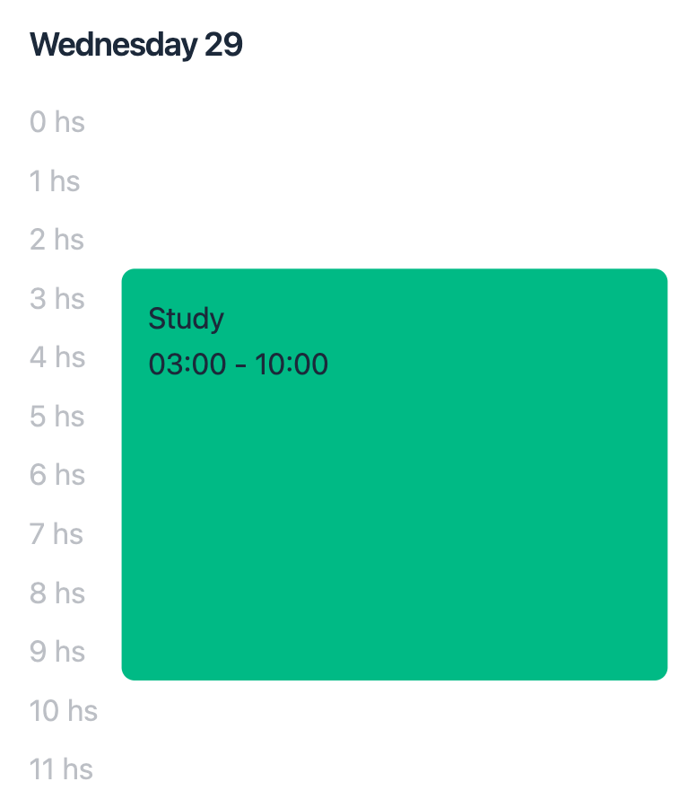

# Headless agenda for react
Completely unstyled components that help you to make your own agenda. Give it a try! It is really simple to use, and allows fully customization (the markup is all yours!). It might look confusing at first but I really think you'll like it.

How it looks with some styling:



<br>

You can easily adapt it for mobile!
<br>




<br>

# Installation

```bash
npm i react-headless-agenda
```

<br>
<br>

# Usage
### Please read this guide, it takes 2 minutes!
All examples use [date-fns](https://www.npmjs.com/package/date-fns) but you can use the library of your choice to manipulate dates.

## `<Agenda>`
Our parent component. It doesn't require any parameter, but you might want to pass it a start day, and some events.

```tsx
import { startOfWeek, addHours }  from 'date-fns'

// only `start` and `end` are required! This event starts now and ends in five hours
const events = [
  {
    id: 'event1',
    someTitle: 'Hey there!',
    start: new Date(),
    end:  addHours(new Date(), 5),
  }
]

// we'll display the current week from its start
<Agenda
  startDate={startOfWeek(new Date())}
  events={events}
/>
```

<br>

## `<Columns>`

It lets you render whatever you need to, for each day. For example, let's render its name and number:



```tsx
import { format }  from 'date-fns'

<div className="flex">
  <Columns>
    {({ date, key }) => (
      <div key={key} className="flex-1">
        {format(date, 'ccc d')}
      </div>
    )}
  </Columns>
</div>
```

<br>

## `<Day>`

It lets you render the events of a day:



```tsx
// this will be inside <Agenda/> and will receive the events from the context. Full examples below.
<Day date={new Date()} >
  {({ containerRef, events }) => (
    <div
      ref={containerRef}
      className="relative h-full"
    >
      {events.map(({ event, top, bottom }) => (
        <div
          className="absolute w-full p-4 rounded-lg"
          style={{ top, bottom }}
        >
          {event.someTitle}
        </div>
      ))}
    </div>
  )}
</Day>
```

That's it! We also have `<HoursColumn>` and `<Needle>`, but you'll see them as you go.

<br>
<br>

# Examples

For these examples I'll assume you have an array with events, where each event has
  - `start` (required)
  - `end` (required)
  - `id`
  - `title`
  - `className`

And also let's say we use [TailwindCSS](https://tailwindcss.com/) because we can't live without it.


## Basic agenda



Here we'll use `<Columns>` two times, one for the header (with the name of the days) and another one to show the events. See how we use `<Day>` for each day.

We'll simply use flexbox to display these columns.

<details>
  <summary>See code</summary>

  <br>

  ```tsx
    import Agenda, { Columns, HoursColumn, Day, Needle } from 'react-headless-agenda'
    import { format } from 'date-fns'
    import { useState } from 'react'

    const Event = ({ title, top, bottom, className }) => (
      <div
        className={`absolute w-full p-4 rounded-lg ${className}`}
        style={{ top, bottom }}
      >
        {title}
      </div>
    )

    export default function BasicAgenda() {
      return (
        <Agenda
          startDate={new Date()}
          events={events}
        >
          {() => (
            <>
              <div className="flex mb-10">
                <Columns>
                  {({ date, key }) => (
                    <div key={key} className="text-center flex-1">
                      {format(date, 'ccc d')}
                    </div>
                  )}
                </Columns>
              </div>
              <div
                className="flex gap-4"
                style={{ height: 700 }}
              >
                <Columns>
                  {({ date, key }) => (
                    <Day key={key} date={date} >
                      {({ containerRef, events }) => (
                        <div
                          ref={containerRef}
                          className="relative h-full flex-1"
                        >
                          {events.map(({ event, top, bottom }) => (
                            <Event
                              key={event.id}
                              top={top}
                              bottom={bottom}
                              {...event}
                            />
                          ))}
                        </div>
                      )}
                    </Day>
                  )}
                </Columns>
              </div>
            </>
          )}
        </Agenda>
      )
    }
  ```
</details>

<br>

## Complete agenda with navigation


What will add here
- `prev` and `next` functions to navigate between weeks
- `<HoursColumn>` to render the hours at the left
- `<Needle>` (that red line at the top left) to indicate the current time

This time we'll use CSS Grid

<details>
  <summary>See code</summary>

  <br>

  ```tsx
    const Event = ({ title, top, bottom, className }) => (
      <div
        className={`absolute w-full p-4 rounded-lg ${className}`}
        style={{ top, bottom }}
      >
        {title}
      </div>
    )

    export default function CompleteAgenda() {

      const [startDate, setStartDate] = useState(new Date())

      return (
        <Agenda
          startDate={startDate}
          onStartDateChange={setStartDate}
          events={events}
        >
          {({ prev, next }) => (
            <>
              <div className="flex justify-center gap-x-5 items-center mb-10">
                <CaretLeft onClick={prev} />
                <h5>{format(startDate, 'MMMM')}</h5>
                <CaretRight onClick={next} />
              </div>
              <div
                className="grid gap-4"
                style={{ gridTemplateColumns: 'repeat(8, 1fr)' }}
              >
                <div />
                <Columns>
                  {({ date, key }) => (
                    <div key={key} className="text-center">
                      {format(date, 'ccc d')}
                    </div>
                  )}
                </Columns>
                <div className="text-center">
                  <HoursColumn>
                    {({ hour }) => (
                      <div key={hour} className="opacity-30 py-1">
                        {hour} hs
                      </div>
                    )}
                  </HoursColumn>
                </div>
                <Columns>
                  {({ date, key }) => (
                    <Day key={key} date={date} >
                      {({ containerRef, events }) => (
                        <div
                          ref={containerRef}
                          className="relative h-full"
                        >
                          {events.map(({ event, top, bottom }) => (
                            <Event key={event.title} {...event} top={top} bottom={bottom} />
                          ))}
                          <Needle>
                            {({ top }) => (
                              <div
                                className="absolute h-1 bg-red-400 z-40 w-full"
                                style={{ top }}
                              />
                            )}
                          </Needle>
                        </div>
                      )}
                    </Day>
                  )}
                </Columns>
              </div>
            </>
          )}
        </Agenda>
      )
    }
  ```
</details>

<br>

## 3 day agenda



This is actually the same code as the previous example! Only provide a custom `days`:

```tsx
<Agenda
  startDate={startDate}
  onStartDateChange={setStartDate}
  events={events}
  days={3} // <----
>
```
And if your are using CSS Grid, the container will look like this:

```tsx
<div
  className="grid"
  style={{ gridTemplateColumns: 'repeat(4, 1fr)' }}
>
```

<br>

## Vertical agenda


Cool! And the code isn't that complicated:

We'll place a `<HoursColumn>` inside the day container this time.

<details>
  <summary>See code</summary>

  <br>

  ```tsx
    const Event = ({ title, top, bottom, className }) => (
      <div
        className={`absolute w-full p-4 rounded-lg ${className}`}
        style={{ top, bottom }}
      >
        {title}
      </div>
    )

    export default function VerticalAgendaDemo() {

      return (
        <Agenda events={events} >
          {() => (
            <Columns>
              {({ date, key }) => (
                <Day key={key} date={date} >
                  {({ containerRef, events }) => (
                    <div>
                      <h4 className="mt-6 py-4">
                        {format(date, 'EEEE d')}
                      </h4>
                      <div
                        ref={containerRef}
                        className="flex gap-x-3"
                      >
                        <div>
                          <HoursColumn>
                            {({ hour }) => (
                              <div key={hour} className="opacity-30 py-1">
                                {hour} hs
                              </div>
                            )}
                          </HoursColumn>
                        </div>
                        <div className="flex-1 relative">
                          {events.map(({ event, top, bottom }) => (
                            <Event
                              key={event.id}
                              top={top}
                              bottom={bottom}
                              {...event}
                            />
                          ))}
                        </div>
                      </div>
                    </div>
                  )}
                </Day>
              )}
            </Columns>
          )}
        </Agenda>
      )
    }
  ```
</details>

<br>

# Tips

You receive all the event inside `<Day>`, you might want to use `start` and `end`:



<details>
  <summary>See code</summary>

  <br>

  ```tsx
    const Event = ({ title, top, bottom, className, start, end }) => (
      <div
        className={`absolute w-full p-4 rounded-lg ${className}`}
        style={{ top, bottom }}
      >
        {title}
        <br />
        {format(start, 'HH:mm')}
        &nbsp;-&nbsp;
        {format(end, 'HH:mm')}
      </div>
    )
  ```
</details>

<br>

The main render function also provides `endDate`, useful to show the current range of days:


<details>
  <summary>See code</summary>

  <br>

  ```tsx
    <Agenda>
      {({ prev, next, endDate }) => (
        <div className="flex justify-center gap-x-5 items-center">
          <CaretLeft onClick={prev} />
          <h5>
            {format(startDate, 'd/M')}
            &nbsp; - &nbsp;
            {format(endDate, 'd/M')}
          </h5>
          <CaretRight onClick={next} />
        </div>
      )}
    </Agenda>
  ```
</details>
